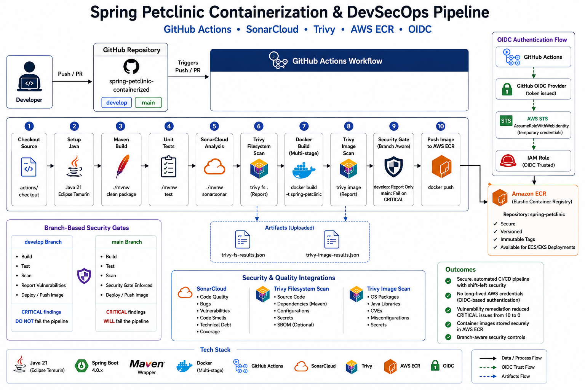
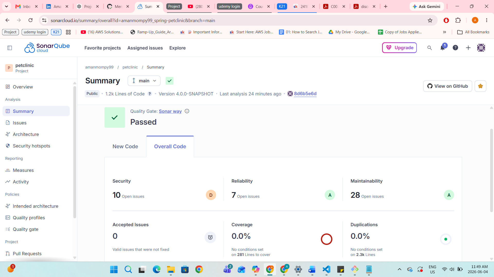
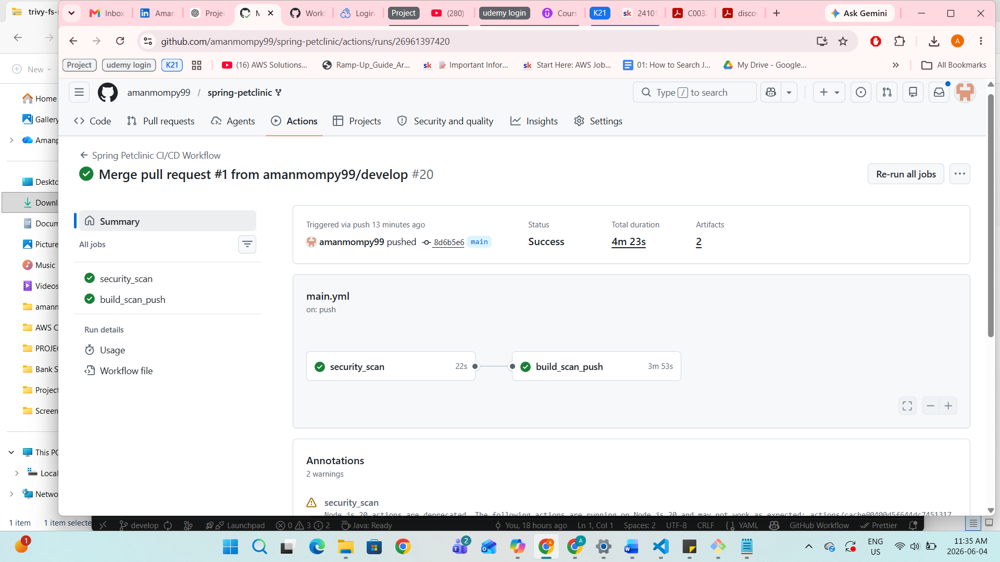

# Project 2 – Spring Petclinic Containerization & DevSecOps Pipeline

## Executive Summary

This project demonstrates the containerization and secure CI/CD implementation of the Spring Petclinic application using GitHub Actions, Docker, SonarCloud, Trivy, AWS Elastic Container Registry (ECR), and GitHub OpenID Connect (OIDC).

The goal was to build a production-style DevSecOps pipeline that automates application builds, testing, code quality analysis, security scanning, container image creation, and secure image publishing to AWS.

A major focus of the project was vulnerability management. Security findings discovered during Trivy scans were investigated using Maven dependency analysis and remediated through dependency upgrades and version overrides, resulting in a reduction of CRITICAL vulnerabilities from 10 to 0.

---

# Architecture Overview

## Architecture Diagram



---

# Project Objectives

* Containerize a Spring Boot application using Docker.
* Implement CI/CD automation using GitHub Actions.
* Integrate SonarCloud for code quality analysis.
* Integrate Trivy for vulnerability scanning.
* Implement secure AWS authentication using OIDC.
* Publish container images to AWS ECR.
* Establish branch-based security gates.
* Practice vulnerability investigation and remediation.

---

# Technology Stack

| Category           | Technology       |
| ------------------ | ---------------- |
| Application        | Spring Petclinic |
| Language           | Java 21          |
| Build Tool         | Maven Wrapper    |
| Containerization   | Docker           |
| CI/CD              | GitHub Actions   |
| Code Quality       | SonarCloud       |
| Security Scanning  | Trivy            |
| Container Registry | AWS ECR          |
| Authentication     | GitHub OIDC      |
| Cloud Platform     | AWS              |

---

# CI/CD Workflow

The pipeline automatically executes when changes are pushed to the repository.

## Workflow Stages

### 1. Source Code Checkout

GitHub Actions checks out the latest source code.

```yaml
uses: actions/checkout@v4
```

---

### 2. Java Setup

Java 21 is configured using Eclipse Temurin.

```yaml
uses: actions/setup-java@v4
```

---

### 3. Maven Build

The application is compiled and packaged.

```bash
./mvnw clean package
```

---

### 4. Unit Testing

Automated tests are executed.

```bash
./mvnw test
```

Purpose:

* Validate application functionality
* Detect regressions early

---

### 5. SonarCloud Analysis

Static code analysis is performed.

```bash
./mvnw sonar:sonar
```

Analysis includes:

* Bugs
* Vulnerabilities
* Security Hotspots
* Code Smells
* Maintainability Issues

---

### 6. Trivy Filesystem Scan

The source code and dependency tree are scanned.

```bash
trivy fs .
```

Output:

```text
trivy-fs-results.json
```

Report is uploaded as a workflow artifact.

---

### 7. Docker Image Build

A multi-stage Docker build creates the application image.

```bash
docker build -t spring-petclinic .
```

---

### 8. Trivy Image Scan

The final container image is scanned.

```bash
trivy image spring-petclinic
```

Analysis includes:

* Operating System packages
* Runtime dependencies
* Java libraries

---

### 9. AWS Authentication using OIDC

GitHub Actions authenticates to AWS without long-lived access keys.

Authentication Flow:

```text
GitHub Actions
        │
        ▼
GitHub OIDC Provider
        │
        ▼
AWS STS
        │
        ▼
AssumeRoleWithWebIdentity
        │
        ▼
IAM Role
        │
        ▼
Amazon ECR
```

Benefits:

* No AWS credentials stored in GitHub
* Temporary credentials
* Improved security posture
* AWS best practice

---

### 10. Push Image to Amazon ECR

Container images are tagged and pushed to ECR.

Example:

```bash
docker push <account-id>.dkr.ecr.<region>.amazonaws.com/spring-petclinic
```

---

# Branching Strategy

## Branch Structure

```text
main
│
└── develop
```

---

## develop Branch

Purpose:

* Active development
* Feature testing
* Security visibility

Behavior:

* Build application
* Run tests
* Execute scans
* Publish reports

Pipeline does not fail on vulnerability findings.

---

## main Branch

Purpose:

* Production-ready releases

Behavior:

* Build application
* Run tests
* Execute scans
* Enforce security gates

Pipeline fails if CRITICAL vulnerabilities are detected.

---

# Docker Implementation

## Multi-Stage Docker Build

The application uses a multi-stage Docker build to separate build dependencies from runtime dependencies.

---

## Build Stage

```dockerfile
FROM maven:3.9-eclipse-temurin-21 AS build
```

Responsibilities:

* Download dependencies
* Compile source code
* Package application

---

## Runtime Stage

```dockerfile
FROM eclipse-temurin:21-jre
```

Responsibilities:

* Run application
* Exclude Maven and build tooling

---

## Benefits

* Smaller image size
* Faster deployments
* Reduced attack surface
* Production-ready runtime image

---

# SonarCloud Integration

## Purpose

Continuous code quality monitoring.

## Metrics Analyzed

* Reliability
* Maintainability
* Security Hotspots
* Technical Debt
* Code Duplication

## Screenshot



---

# Trivy Security Scanning

## Filesystem Scan

Command:

```bash
trivy fs .
```

Scans:

* Maven dependencies
* Configuration files
* Source tree

## Screenshot


---

## Container Image Scan

Command:

```bash
trivy image spring-petclinic
```

Scans:

* OS packages
* Runtime libraries
* Container vulnerabilities

## Screenshot


---

# Vulnerability Remediation Walkthrough

## Initial Findings

Trivy identified:

* 10 CRITICAL vulnerabilities
* Multiple HIGH vulnerabilities

Most findings were associated with Apache Tomcat dependencies.

---

## Investigation Process

### Step 1

Review Trivy reports.

---

### Step 2

Analyze Maven dependency tree.

```bash
./mvnw dependency:tree
```

---

### Step 3

Identify vulnerable component.

```text
Apache Tomcat 11.0.21
```

---

## Root Cause

The vulnerable Tomcat version was introduced through the Spring Boot dependency chain.

---

## Remediation

### Spring Boot Upgrade

```text
4.0.3 → 4.0.6
```

### Explicit Tomcat Version Override

```xml
<tomcat.version>11.0.22</tomcat.version>
```

---

## Validation

Re-ran:

```bash
trivy fs .
trivy image spring-petclinic
```

Results:

```text
CRITICAL Vulnerabilities: 0
```

---

## Security Outcome

| Metric                   | Before   | After   |
| ------------------------ | -------- | ------- |
| Critical Vulnerabilities | 10       | 0       |
| High Vulnerabilities     | Multiple | Reduced |
| Security Gate            | Failed   | Passed  |

## Screenshot


---

# AWS ECR Integration

## Purpose

Store container images securely.

## Benefits

* Centralized registry
* Version tracking
* Integration with ECS/EKS
* Secure image storage

## Screenshot


---

# Screenshots

## GitHub Actions Pipeline



## SonarCloud Dashboard


## Trivy Filesystem Scan


## Trivy Image Scan


## AWS ECR Repository


---

# Key Learnings

## DevOps

* CI/CD automation using GitHub Actions
* Branch-based deployment workflows
* Artifact management

## Containers

* Multi-stage Docker builds
* Image optimization
* Runtime security

## Cloud

* AWS ECR integration
* OIDC-based authentication

## DevSecOps

* Shift-left security
* Vulnerability scanning
* Dependency analysis
* Security gate implementation

## Software Engineering

* Maven dependency management
* Root cause investigation
* Remediation validation

---

# Interview Talking Points

## Why Use Multi-Stage Docker Builds?

To reduce image size and eliminate unnecessary build dependencies from runtime containers.

---

## Why Trivy?

Trivy provides fast and effective vulnerability scanning for both source dependencies and container images.

---

## Why OIDC Instead of AWS Access Keys?

OIDC eliminates long-lived credentials by allowing GitHub Actions to obtain temporary AWS credentials through AWS STS.

---

## What Was the Most Valuable Part of the Project?

Investigating and remediating transitive dependency vulnerabilities introduced through embedded Tomcat libraries.

---

## How Were Vulnerabilities Resolved?

* Trivy report analysis
* Maven dependency tree review
* Spring Boot upgrade
* Tomcat version override
* Validation through rescanning

---

# Future Enhancements

## Security

* SBOM generation
* Dependency Track integration
* Cosign image signing

## Platform

* Amazon EKS deployment
* Kubernetes manifests
* GitOps with ArgoCD

## Observability

* Prometheus
* Grafana
* Loki
* OpenTelemetry

## Automation

* Automated release tagging
* Environment promotion workflows
* Policy-as-Code integration

---

# Repository Structure

```text
spring-petclinic-containerized
│
├── .github/
│   └── workflows/
│       └── main.yml
│
├── .mvn/
│
├── docs/
│   ├── Project-Documentation.md
│   └── images/
│
├── src/
│
├── Dockerfile
├── pom.xml
├── mvnw
├── mvnw.cmd
├── README.md
└── .gitignore
```

